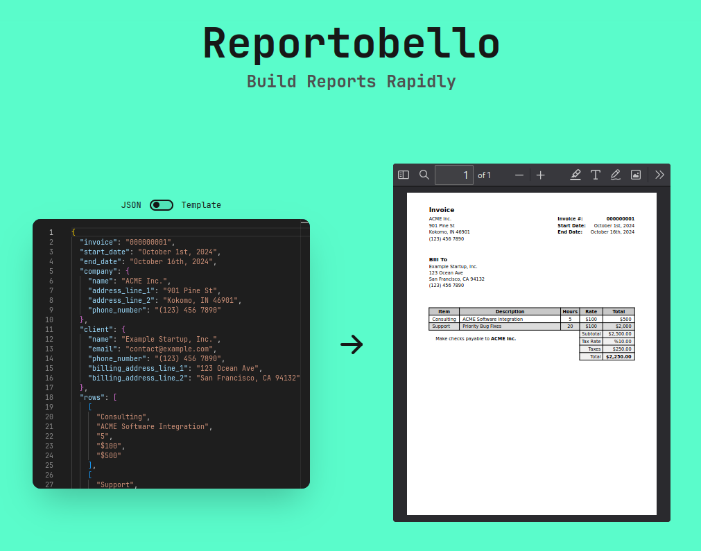
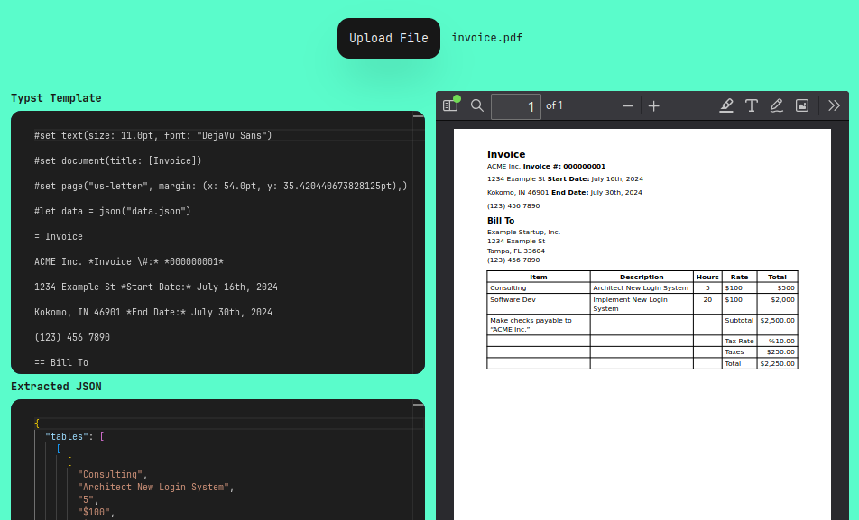
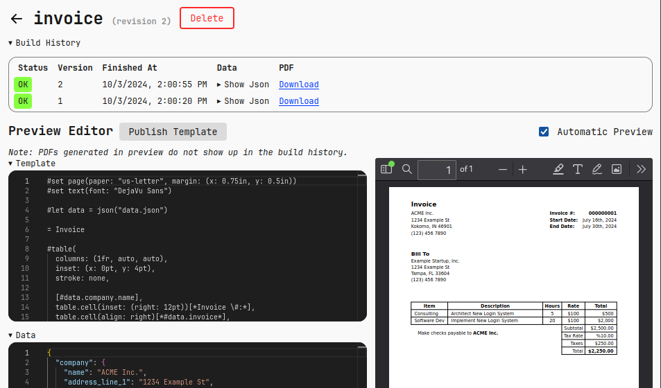
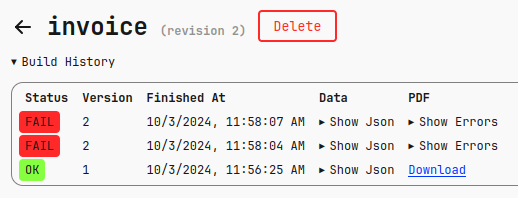
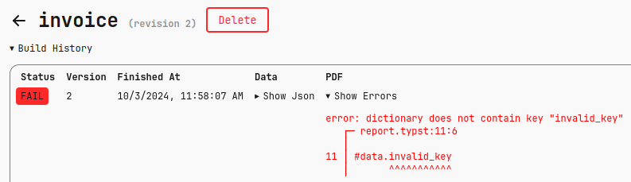
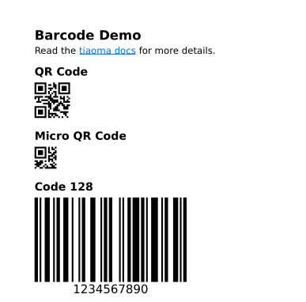

While there are plenty of PDF generators out there, Reportobello is different:
Reportobello uses [Typst](https://typst.app), a blazing-fast Rust library, as it's templating engine.

Reportobello was built out of frusturation with existing PDF generators' lacking features,
slow performance, poor SDK support, and so on.

## Goals

Reportobello's main goals are, in no particular order:

1. Simplicity: Building a report is as easy as sending JSON to a predefined template
2. Reliability: Build reports confidently, and diagnose issues quickly
3. Performance: Reports should be built almost instantly (sub 500ms for most PDFs)

## Features

<table>
  <tr>
    <td>JSON API</td>
    <td>Read the <a href="https://reportobello.com/swagger">Swagger docs.</a></td>
  </tr>
  <tr>
    <td>SDK Support</td>
    <td>Reportobello currently supports <a href="https://reportobello.com/docs/libraries/python.html">Python</a>, <a href="https://reportobello.com/docs/libraries/csharp.html">C#</a>, and <a href="https://reportobello.com/docs/libraries/typescript.html">JavaScript/Typescript.</a></td>
  </tr>
  <tr>
    <td>Powerful templating via <a href="https://typst.app/docs/reference">Typst</a></td>
    <td><pre lang="typst">= Invoice #data.invoice_number&#10;&#10;#table(&#10;  header: ([Description], [Hours], [Rate], [Total]),&#10;&#10;  ..data.rows&#10;)</pre>
    </td>
  </tr>
  <tr>
    <td>Generate templates from existing PDFs (beta)</td>
    <td></td>
  </tr>
  <tr>
    <td>Template editor (beta)</td>
    <td></td>
  </tr>
  <tr>
    <td>Audit logs for built PDFs</td>
    <td></td>
  </tr>
  <tr>
    <td>Quickly debug failed PDF builds</td>
    <td></td>
  </tr>
  <tr>
    <td>Barcode and QR code support via <a href="https://typst.app/universe/package/tiaoma">Tiaoma</a></td>
    <td></td>
  </tr>
</table>

## Coming Soon

* Bulk PDF generation
* Publish PDFs to S3
* Create template from HTML
* OCR support for template extractor/converter
* PNG/SVG/HTML export
* Password protected PDFs
* Customizable retention policies
* User accounts
* Dark mode (for UI)

## Installation

Run the following Docker command to start the Reportobello server:

```
$ docker run -it \
    --name reportobello \
    -p 8000:8000 \
    -v /var/run/docker.sock:/var/run/docker.sock \
    -v /tmp:/tmp \
    ghcr.io/reportobello/server
```

<details>
    <summary>Explaination of arguments</summary>

* `-it`: Run in an interactive terminal, needed to properly show color.
* `-p`: Expose Reportobello on port 8000.
* `-v`: This mounts the host Docker socket into the container. This allows Reportobello to spin-off containers during PDF generation/extraction.

</details>

You will see the following (or similar) output:

```
reportobello-1  |
reportobello-1  | "admin" API key: rpbl_8dCCwVD4kMtmk_s3qODaiaa9_6MVyHXnhTODuohdcZI
reportobello-1  |
reportobello-1  | 2024-10-20T01:22:27.952 INFO:     Started server process [1]
reportobello-1  | 2024-10-20T01:22:27.952 INFO:     Waiting for application startup.
reportobello-1  | 2024-10-20T01:22:27.952 INFO:     Application startup complete.
reportobello-1  | 2024-10-20T01:22:27.952 INFO:     Uvicorn running on http://0.0.0.0:8000 (Press CTRL+C to quit)
```

## Running

* Copy the `rpbl_...` API key

* Navigate to [http://localhost:8000]()

* Log in using your API key

* Start using Reportobello!

When you're done type CTRL+C, and re-run using the following:

```
$ docker run reportobello
```

To use Reportobello in a production environment, read the [self-hosting docs](https://reportobello.com/docs/self-hosting.html).
